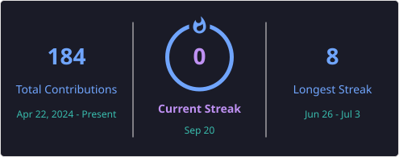

# 👋 Hi, I'm Bidur Khanal

### AI Enthusiast | Python Developer | Backend Developer | Data Analyst

---

## 🌐 Socials

---

## 💻 Tech Stack

---

## 🤖 AI / Machine Learning

---

## 🔥 GitHub Streak

## 📈 Top Languages

---
##🚀 About Me
🎓 BSc CSIT Student
🤖 Interested in Artificial Intelligence and Machine Learning
🐍 Python Developer
⚙️ Backend Developer
📊 Data Analyst
📈 Interested in Data Analysis and Visualization
💻 Interested in building intelligent applications
📚 Currently learning AI/ML, Data Analytics, and Backend Development
🔍 Open to internships and full-time opportunities

---

## 📫 Connect With Me

If you are interested in collaboration, internships, projects, or development opportunities, feel free to connect with me.

---

⭐ Thanks for visiting my profile!
